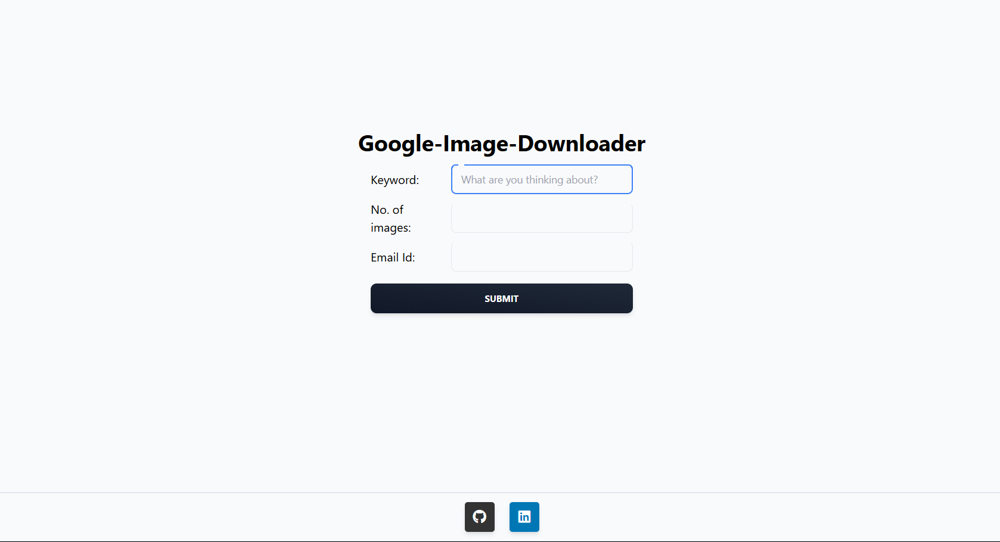

# Google Image Downloader

This project is a web-based tool that allows users to download images from Google based on specific keywords. The images are downloaded directly to the server and a notification is sent via email once the download process is completed.

## Table of Contents

- [Project Snapshot](#project-snapshot)
- [Features](#features)
- [Technologies Used](#technologies-used)
- [Setup Instructions](#setup-instructions)
- [How to Use](#how-to-use)
- [Contributing](#contributing)

## Project Snapshot



## Features

- Search and download images from Google based on user input (keywords and image count).
- Backend powered by Node.js and Express for handling image search requests.
- Uses iCrawler for crawling Google Images.
- Notifications sent via email upon successful image download through yagmail.

## Technologies Used

- **Frontend**: React.js, Tailwind CSS, Material Tailwind
- **Backend**: Node.js, Express
- **Python**: iCrawler (for crawling and downloading images)
- **Email Notifications**: yagmail

## Setup Instructions

### Prerequisites

Make sure you have the following installed on your local machine:

- [Node.js](https://nodejs.org/)
- [Python 3](https://www.python.org/)
- [pip](https://pip.pypa.io/en/stable/installation/) (Python package manager)

### Steps to Run Locally

1. **Clone the repository:**

   ```bash
   git clone https://github.com/sidharthd7/Google-Image-Downloader.git
   cd Google-Image-Downloader
   ```

2. **Install dependencies for both server and client:**

   - Navigate to the `client` folder and install dependencies:

     ```bash
     cd client
     npm install
     ```

   - Navigate to the `server` folder and install dependencies:

     ```bash
     cd ../server
     npm install
     ```

3. **Install Python dependencies:**

   Make sure you are in the root of the project, then:

   ```bash
   pip install -r requirements.txt
   ```

4. **Set up environment variables:**

   Create a `.env` file in the `server` directory with the following content:

   ```
   EMAIL=your_email@example.com
   EMAIL_PASSWORD=your_email_password
   ```


5. **Run the server:**

   Inside the `server` directory:

   ```bash
   node app.js
   ```

6. **Run the frontend client:**

   Inside the `client` directory:

   ```bash
   npm run dev
   ```

7. **Open the browser:**

   The client should now be running at `http://localhost:5173/`, and the backend at `http://localhost:5000/`.

## How to Use

1. Enter a search keyword and the number of images to download in the form.
2. Provide your email address to get notified when the image downloading is complete.
3. Click the "Submit" button to start the process.
4. The result will be shown once the images are downloaded, and an email will be sent with the notification.

## Contributing

Contributions are welcome! Feel free to open an issue or submit a pull request if you have ideas for improvement.
